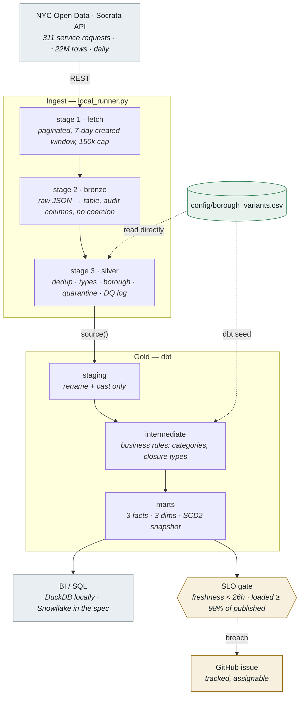

# Architecture

Deep detail moved out of the README so that document stays skimmable. This is
the *how it is built* companion; the README covers what it does, how it is
operated, and the decisions worth arguing about.

---

## Architecture



**Reading it:** the only boundary that matters is `source()` — everything left of
it is Python that owns I/O and row-level cleaning; everything right of it is SQL
that owns meaning. `silver_transformations.py` sits inside stage 3 and holds the
logic, so it can be unit-tested without a database.

The borough mapping is drawn dotted because it is *configuration, not code*: one
CSV read directly by the Python transform and loaded as a dbt seed, so the two
engines cannot disagree.

---

## Stack

| Layer | Tool | Why This Tool |
|---|---|---|
| Infrastructure | Terraform | Declarative drift detection; least-privilege enforced as code |
| Storage *(spec)* | Azure Data Lake Storage Gen2 | Cheap, durable raw archive. **Not provisioned** — locally the raw layer is a JSON file on disk ([ADR 008](adr/008-prototype-scope.md)) |
| Processing | pandas (`silver_transformations.py`) | Pure functions over DataFrames, unit-tested without a database; the transform runs before the load ([ADR 014](adr/014-transform-before-load.md)) |
| Warehouse | Snowflake | Auto-suspend compute; best-in-class dbt adapter; strict role isolation |
| Transformation | dbt Core | Version-controlled SQL; DAG lineage; schema test framework as a quality gate |
| Orchestration | GitHub Actions *(live)* · Apache Airflow *(demo)* | `daily-run.yml` is what actually runs daily ([ADR 010](adr/010-scheduled-operation.md)); the Airflow DAG demonstrates the same 7 tasks with `BashOperator` |
| CI/CD | GitHub Actions | `terraform fmt`+`validate` on PRs and main pushes; `dbt parse` + pytest suite on main pushes and PRs |

---

## Outcomes at Each Layer

### Raw Ingestion — `local_runner.py` stage 1
Pulls 311 records from the Socrata API in 50,000-row pages (the API maximum), writing raw JSON to `local/data/raw/`. The daily path fetches a trailing 7-day window on `created_date`, fails on a row-cap breach or a zero-row response, and captures the source's own count for yesterday — the number that makes SLO-2 a reconciliation. An optional `SOCRATA_APP_TOKEN` raises the rate limit; no other credential is required.

**Outcome:** An unmodified copy of exactly what the API returned, replayable into Silver and Gold without re-calling the source. It is a rolling 7-day window, not a permanent archive — the file is overwritten each run, so "replay" means replay of the current window.

---

### Bronze — `local_runner.py` stage 2
Registers `bronze.service_requests` as a **view** over the raw file rather than copying it into the warehouse ([ADR 014](adr/014-transform-before-load.md)). DuckDB's `read_json_auto` infers the schema on read, so columns the city adds propagate without a migration. Nothing is written here, which is the point: the transform happens next, and the load after it.

**Outcome:** Raw stays SQL-queryable at zero storage cost — the route by which `council_district`, `bbl` and `police_precinct` remain reachable even though Gold drops them. The only added columns are `_ingest_timestamp` and `_source_file`.

---

### Silver — `local_runner.py` stage 3 + `silver_transformations.py`
Applies the data quality rules that make analysis trustworthy:
- Deduplication on `unique_key` (the city's natural key) removes duplicates created by API pagination overlap
- 24 borough name variants are standardized to five canonical forms, from one shared mapping ([config/borough_variants.csv](../config/borough_variants.csv)) read by the pandas transform, the pandas runner, and both dbt projects
- Records where the closed date precedes the created date are quarantined and logged ([silver_transformations.select_quarantine](../local/silver_transformations.py)) — data entry errors that would corrupt resolution time metrics
- `resolution_days` is calculated as a null-safe value: null for open requests, never zero

Silver is rebuilt in full from the current window each run (`CREATE OR REPLACE`), so it always reflects the latest fetch rather than accumulating. History accumulates in Gold instead, where `fct_service_requests` is incremental.

**Outcome:** A clean, deduplicated, typed dataset where `resolution_days` is always meaningful and borough names always join correctly to the dimensional model.

---

### Gold — dbt models
dbt builds the full star schema from Silver:

- `stg_service_requests` — renames and casts columns, generates surrogate keys, maps `_silver_timestamp` as the incremental watermark
- `int_service_requests_cleaned` — applies business classification (complaint categories, borough normalization)
- `fct_service_requests` — the core fact table; incremental MERGE on `unique_key` with a 1-hour lookback buffer; clustered on `cast(created_date as date)` for Snowflake scan efficiency
- `fct_daily_volume` — pre-aggregated complaint counts by day, borough, and category for fast dashboard queries
- `dim_date` — 21-year calendar spine (2010–2030) with US federal holiday flags
- `dim_agency` — clean agency dimension with full names and abbreviations
- `dim_location` — geographic dimension: borough, community board, ZIP code (point coordinates stay on the fact as `latitude`/`longitude`)

**Outcome:** A dimensional model a BI analyst can connect to immediately. Every join is LEFT JOIN (open requests with no closed date don't silently disappear from the fact table). Every key is tested for uniqueness and non-null values.

---

### Orchestration — Airflow DAG
Seven tasks in a linear dependency chain:

```
check_api_availability → ingest_raw → load_bronze → load_silver → dbt_build → dbt_publish → notify_success
```

The `check_source` task at the front runs a plain `curl` and validates the HTTP status only — it discards the body (`-o /dev/null`), so a source returning `200` with an empty array passes it; the zero-row check in `fetch_live_records` catches that one task later. There is no sensor and no waiting behaviour (an earlier version of this file described an `HttpSensor` that does not exist).

**Outcome:** No wasted compute on a broken source, and no window where bad data is live in Gold. A failed build or test halts before publish; production keeps serving the last validated build.

---

### Infrastructure — Terraform
Provisions the Snowflake hierarchy from scratch (all five schemas — BRONZE, SILVER, GOLD, GOLD_AUDIT, SNAPSHOTS; the swap's OWNERSHIP transfer stays an apply-time step, ADR 009):

- Four roles with a least-privilege grant matrix: `NYC311_ADMIN`, `NYC311_LOADER` (Bronze write-only), `NYC311_TRANSFORMER` (Bronze read, Silver/Gold/audit/snapshots write), `NYC311_REPORTER` (Gold read-only, symmetric on GOLD_AUDIT for the publish swap)
- `FUTURE TABLES` grants mean any new dbt model automatically inherits the correct permissions — no post-deploy Terraform re-apply required
- All environment differences (dev vs. prod) are handled by a single `environment` variable — no duplicated config
- Remote state in Azure Blob with lease locking for safe team collaboration

**Outcome:** A new environment (dev, staging, prod) is one `terraform apply` away. Role permissions are auditable, diffable, and version-controlled — not scattered across Snowflake worksheets run by hand.

---

<a name="test-suite"></a>

---

## Where to go next

- [README](../README.md) — findings, design decisions, operating record
- [docs/adr/](adr/) — the decision records behind each choice
- [docs/SLO.md](SLO.md) — the service level objectives, with executable queries
- [docs/CLAIMS.md](CLAIMS.md) — claim → enforcing code → verifying test
