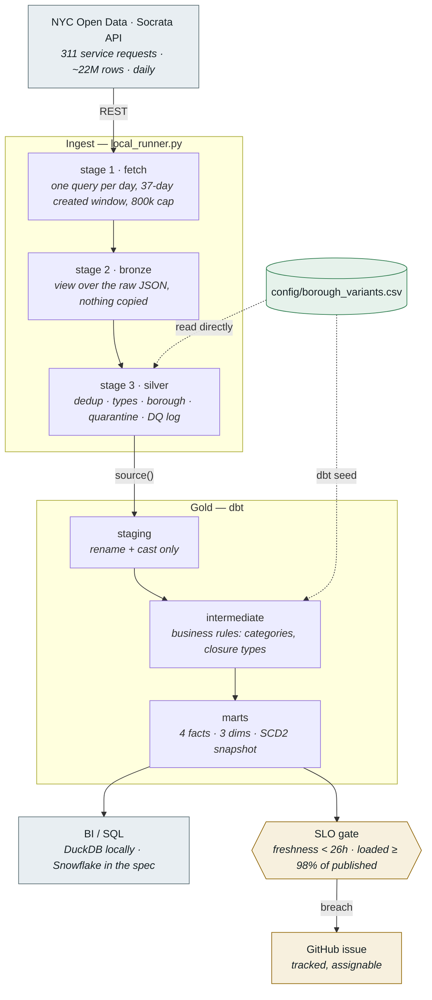

# Architecture

How the pipeline is built, layer by layer. The [README](../README.md) covers what it does, how it is operated, and what the data shows.

---

## Data flow


```mermaid
flowchart TD
    API["NYC Open Data · Socrata API<br/><i>311 service requests · ~22M rows · daily</i>"]

    subgraph INGEST["Ingest — local_runner.py"]
        S1["stage 1 · fetch<br/><i>one query per day, 37-day created window, 800k cap</i>"]
        S2["stage 2 · bronze<br/><i>view over the raw JSON, nothing copied</i>"]
        S3["stage 3 · silver<br/><i>dedup · types · borough · quarantine · DQ log</i>"]
    end

    subgraph GOLD["Gold — dbt"]
        STG["staging<br/><i>rename + cast only</i>"]
        INT["intermediate<br/><i>business rules: categories, closure types</i>"]
        MRT["marts<br/><i>4 facts · 3 dims · SCD2 snapshot</i>"]
    end

    OUT["BI / SQL<br/><i>DuckDB locally · Snowflake in the spec</i>"]
    SLO{{"SLO gate<br/><i>freshness &lt; 26h · loaded ≥ 98% of published</i>"}}

    API -->|"REST"| S1 --> S2 --> S3
    S3 -->|"source()"| STG --> INT --> MRT --> OUT
    MRT --> SLO
    SLO -->|"breach"| ISSUE["GitHub issue<br/><i>tracked, assignable</i>"]

    CFG[("config/borough_variants.csv")] -.->|"read directly"| S3
    CFG -.->|"dbt seed"| INT

    classDef ext fill:#e8eef2,stroke:#5A6E74,color:#182226
    classDef gate fill:#f7f0de,stroke:#8F6400,color:#182226
    classDef cfg fill:#e6f2eb,stroke:#2E7D4F,color:#182226
    class API,OUT ext
    class SLO,ISSUE gate
    class CFG cfg
```

**Reading it:** the boundary that matters is `source()`, where dbt reads Silver. Left of it is Python, which owns input/output and row-level cleaning. Right of it is SQL, which owns meaning. `silver_transformations.py` holds the stage-3 logic as plain functions, so it can be unit-tested without a database.

The borough mapping is drawn dotted because it is configuration, not code: one CSV that the pandas transform reads directly and dbt loads as a seed (a CSV turned into a table), so the two cannot disagree.

---

## Stack

| Layer | Tool | Why this tool |
|---|---|---|
| Raw storage | JSON file on disk | The raw layer is one file per run; there is no cloud storage ([ADR 008](adr/008-prototype-scope.md)) |
| Processing | pandas (`silver_transformations.py`) | Pure functions over DataFrames, unit-tested without a database; the transform runs before the load ([ADR 014](adr/014-transform-before-load.md)) |
| Warehouse | DuckDB (runs) · Snowflake (spec) | DuckDB is a single file, so the pipeline runs anywhere; Snowflake is the designed serving layer ([ADR 001](adr/001-warehouse-selection.md)) |
| Transformation | dbt Core | Version-controlled SQL, lineage, and tests that run inside every build |
| Orchestration | GitHub Actions *(live)* · Apache Airflow *(demo)* | `daily-run.yml` is what runs daily ([ADR 010](adr/010-scheduled-operation.md)); the Airflow DAG runs the same stages as 7 tasks |
| CI | GitHub Actions | `ci.yml`: dbt parse, three pytest tiers, the claim and mirror checks, lint ([ADR 011](adr/011-parallel-ci-tiers.md)); `terraform.yml`: fmt and validate |
| Infrastructure | Terraform | The Snowflake foundation (never applied) and this repo's GitHub settings (applied, [ADR 012](adr/012-github-repo-as-code.md)) |

---

## Layers

### Fetch — `local_runner.py` stage 1

Downloads every request with `created_date` in the last 37 days, one day per query in 50,000-row pages (the API maximum), and writes it to one file, `nyc311_raw.json` in `local/data/raw/`. The whole window is re-fetched every run, which is how a request's later status changes reach Gold.

Why 37 days: 30 days is NYC's closure standard, and the source's copies of a day keep changing for about 7 days ([ADR 016](adr/016-source-settling-horizon.md)). A shorter window made closure rates read low, because Gold stopped seeing a request once it left the window ([ADR 010](adr/010-scheduled-operation.md)). A request older than 37 days keeps the status it had when it left. To refresh older rows, run once with a wider window (`--live --days N`).

The same stage asks the source for its own per-day counts across the window, which is what SLO-2 reconciles against. The source answers from two copies ("replicas"), one of which can lag, so the count query runs 11 times and keeps each day's highest answer ([docs/SLO.md](SLO.md#slo-2--completeness-source-reconciliation)).

Failures are loud. A connection error, 429 or 5xx is retried twice with backoff; any other error fails the run. Zero rows, or more than 800,000, also fail: the run is either red or fully loaded, never partly loaded. An optional `SOCRATA_APP_TOKEN` raises the API's rate limit; no other credential is needed.

**Outcome:** an exact copy of what the API returned, which Silver and Gold can be rebuilt from without calling the source again. The file is overwritten each run, so it holds the current window, not an archive.

### Bronze — `local_runner.py` stage 2

Registers `bronze.service_requests` as a **view** over the raw file rather than copying it into the database ([ADR 014](adr/014-transform-before-load.md)). DuckDB infers columns on read, so a field the city adds appears without a migration. The view adds only `_ingest_timestamp` and `_source_file`.

**Outcome:** the raw data stays queryable at no storage cost, including fields Gold drops (`council_district`, `bbl`, `police_precinct`).

### Silver — `local_runner.py` stage 3 + `silver_transformations.py`

- Removes duplicates on `unique_key`, the city's own key.
- Maps 24 borough spellings to the five boroughs, from the shared [config/borough_variants.csv](../config/borough_variants.csv).
- Quarantines rows whose closed date is before their created date ([`select_quarantine`](../local/silver_transformations.py)). They go to `silver.quarantine` so dbt can also delete them from Gold. Silver works out days-to-close only to find these rows; it does not store it. Gold's calendar-day `resolution_days` is the one definition.
- Appends one row per quality check per day to `silver.data_quality_log`.

Silver is replaced on every run (`CREATE OR REPLACE`), so it always equals the latest fetch. History accumulates in Gold instead.

**Outcome:** clean, de-duplicated, typed rows whose borough names always join to the dimensional model.

### Gold — dbt models

dbt builds the star schema from Silver. The list below is checked against the dbt manifest by `scripts/check_claims.py`: a model missing from the list, or a listed model that no longer exists, fails CI.

<!--model-inventory-->
**staging** — one view per source table, rename and cast only:

- `stg_service_requests` — renames and casts columns, generates the surrogate key `service_request_id` (an ID made by hashing the city's `unique_key`), and exposes `_silver_timestamp` as `_loaded_at`, the watermark: each run takes rows loaded after the newest one already in Gold, minus a 1-hour safety margin
- `stg_quarantine` — passthrough over the Silver quarantine table, so `fct_service_requests` can delete rejected rows without a mart referencing a source
- `stg_data_quality_log` — passthrough over the per-run Silver check results

**intermediate** — business rules, in SQL, once:

- `int_service_requests_cleaned` — borough normalisation, calendar-day `resolution_days`, complaint categories and closure types; drops rows closed before they were created
- `int_load_completeness` — one row per loaded day, carrying `is_complete_day`. The source publishes on a variable lag, so the newest loaded day is usually partial. Every model that needs "where does trustworthy history end" reads this instead of working it out again

**marts** — the star:

- `fct_service_requests` — the core fact table, one row per request; incremental (merge on `service_request_id`) with the 1-hour lookback above, so each run updates rows whose status changed; clustered on `cast(created_date as date)` on Snowflake
- `fct_daily_volume` — counts by day, borough and category for dashboards, with `is_complete_day` so a partial day can be left out. Every *rate* counts closures within `closure_window_days` (30) and is published only where `is_denominator_closed`, meaning 30 complete days have followed; a younger day's rate would read low, so it is NULL
- `fct_complaint_recurrence` — one row per closed request with a usable address: did the same complaint come back to the same address? Emits `days_to_next_same_complaint` and `observation_days` rather than a fixed window, so a recent closure cannot be counted as "did not recur". Rebuilt each run from the Silver window, so it covers about the last 37 days
- `fct_data_quality` — every Silver quality check, with a rolling 7-day failure rate and a threshold-breach flag for a dashboard; nothing fails or alerts on it
- `dim_date` — 21-year calendar (2010–2030) with US federal holiday flags
- `dim_agency` — agency history as SCD Type 2 (a *slowly changing dimension* that keeps old versions, so a renamed agency keeps its old name on old requests), built from the snapshot, with a `[valid_from, expiry_date)` validity window
- `dim_location` — borough, community board and ZIP code (point coordinates stay on the fact as `latitude`/`longitude`)
<!--/model-inventory-->

Design choices in the fact table:

- **Every dimension join is a LEFT JOIN.** A request with an unknown agency or an address that cannot be matched keeps its fact row with a NULL key. An INNER JOIN would silently drop it, and `COUNT(*)` would stop matching Silver. Primary keys are tested unique and not null; foreign keys carry `relationships` tests.
- **`is_overdue` is NULL while a request is open, not FALSE.** A FALSE would let `WHERE NOT is_overdue` count open requests as "on time". It keys on `status = 'Closed'`, not on whether `closed_date` is set, because the source sends a `closed_date` on some requests that are still open.
- **Two post-hooks (SQL that dbt runs right after building the table) keep an incremental run equal to a full rebuild.** They delete rows the quality filter or the Silver quarantine rejected in this run.

**Outcome:** a dimensional model a BI analyst can connect to directly.

---

## The two copies of the dbt project

`dbt/` targets Snowflake and is validated but never run against a warehouse. `local/` is a DuckDB copy of it, and it is what the daily run builds. The copies are meant to be identical, comments included, except where the SQL dialects differ:

| Snowflake (`dbt/`) | DuckDB (`local/`) |
|---|---|
| `::timestamp_ntz` | `::timestamp` |
| `to_char(...)`, `decode(...)` | `strftime(...)` |
| `dateadd(...)` | `INTERVAL` arithmetic |
| `dayofweekiso` / `weekiso` | `isodow` / `weekofyear` (same ISO values) |
| `cluster_by` config | removed (DuckDB has no clustering) |
| `merge` incremental strategy | `delete+insert` (same upsert, update-or-insert, on the unique key) |
| `initcap(name)` in the agency snapshot | split-and-capitalise on spaces. **Known difference:** Snowflake's `initcap` also capitalises after hyphens and brackets, so such agency names differ |
| `publish_gold` macro (schema swap) | absent: the DuckDB path builds straight into Gold, with no write-audit-publish |
| Snowflake database and schema in `sources.yml` | the local DuckDB file |

Both `sources.yml` files declare dbt source-freshness thresholds, but nothing in the repo runs `dbt source freshness`; the daily run measures freshness with [SLO-1](SLO.md#slo-1--freshness) instead.

Every allowed difference is recorded in `scripts/model_drift_baseline.json`. [`scripts/check_model_drift.py`](../scripts/check_model_drift.py) fails CI when the copies differ in any other way. After an intended change to both sides, re-record with `python scripts/check_model_drift.py --update` and review the baseline diff like code.

---

## Orchestration — Airflow DAG

A demonstration of the same pipeline as seven tasks in a line. The chain below is compared name by name against the DAG by `scripts/check_claims.py`:

<!--dag-tasks:airflow/dags/nyc311_local.py-->
```
check_source → fetch_live → load_bronze → load_silver → dbt_build → check_slos → upstream_stall_check
```

The order is tested by [tests/test_pipeline_components.py](../tests/test_pipeline_components.py)`::test_local_dag_orders_tasks_correctly`, which rebuilds the DAG's edges from its source code and asserts the ones that matter (Silver loads before dbt builds; dbt builds before the SLOs are read).

`check_source` runs `curl` against the API and checks only the HTTP status. It discards the body, so a source returning `200` with an empty list passes; the zero-row check in `fetch_live_records` catches that one task later. Its value is cost: a dead endpoint fails the run in seconds instead of part-way through a load.

`check_slos` exits 1 on a breach, so a breach is a red run. `upstream_stall_check` exits 0 either way: a stall in the city's publishing must stay visible without turning a correct run red ([ADR 013](adr/013-no-source-freshness-slo.md)).

**Outcome:** a red run names the stage that broke. The scheduled run is `.github/workflows/daily-run.yml`, not this DAG ([ADR 010](adr/010-scheduled-operation.md)).

---

## Infrastructure — Terraform (specified, validated in CI, never applied)

The Snowflake module would create five schemas (BRONZE, SILVER, GOLD, GOLD_AUDIT, SNAPSHOTS) and four roles:

- `NYC311_ADMIN`; `NYC311_LOADER` (writes Bronze only, with no UPDATE or TRUNCATE); `NYC311_TRANSFORMER` (reads Bronze, writes Silver, Gold, the audit schema and snapshots); `NYC311_REPORTER` (reads Gold only).
- **Write-audit-publish.** dbt would build and test into GOLD_AUDIT, then `publish_gold` swaps it into GOLD in one step, so readers never see untested tables. Snowflake grants attach to the schema object and the swap exchanges objects, so REPORTER's grants are declared on both GOLD and GOLD_AUDIT ([ADR 009](adr/009-publish-grants-under-schema-swap.md)).
- `FUTURE TABLES` grants give each new dbt table the right permissions without re-running Terraform.
- One `environment` variable (dev, staging, prod) drives every difference between environments; state would live in Azure Blob Storage with locking.

The applied module, `terraform/github/`, manages this repository's labels, branch protection and Pages site ([ADR 012](adr/012-github-repo-as-code.md)).

---

## Where to go next

- [README](../README.md) — what it does, how it is operated, what the data shows
- [docs/SLO.md](SLO.md) — the two SLOs, with their exact queries
- [docs/adr/](adr/) — the decision records
- [docs/CLAIMS.md](CLAIMS.md) — each claim, the code that enforces it, and the test that checks it
